# Flutter Training — External Technical Documentation
## Days 1 & 2: Clean Architecture + Networking

**Author:** Mohamed Ramadan  
**Date:** 2026-06-21  
**Covers:** Day 1 (Clean Architecture & Project Skeleton) · Day 2 (Networking & the API Client)  
**Status:** Days 3 & 4 notes pending — will be added when completed

---

## Table of Contents

1. [Day 1 — Clean Architecture & Project Skeleton](#day-1--clean-architecture--project-skeleton)
   - [Why Architecture Matters](#1-why-architecture-matters)
   - [The Three Layers](#2-the-three-layers)
   - [The Dependency Rule](#3-the-dependency-rule)
   - [The Domain Layer](#4-the-domain-layer)
   - [Dependency Inversion Principle](#5-dependency-inversion-principle-the-d-in-solid)
   - [DTO vs Entity — The Mapper Pattern](#6-dto-vs-entity--the-mapper-pattern)
   - [The Two Magic Boundaries](#7-the-two-magic-boundaries)
   - [REST vs GraphQL](#8-rest-vs-graphql)
   - [When to Skip Use Cases](#9-when-to-skip-use-cases)
   - [Day 1 Interview Key Phrases](#10-day-1-interview-key-phrases)
2. [Day 2 — Networking & the API Client](#day-2--networking--the-api-client)
   - [The One Front Door Concept](#1-the-one-front-door-concept)
   - [HTTP Fundamentals](#2-http-fundamentals)
   - [Interceptors — The Core Concept](#3-interceptors--the-core-concept)
   - [The Four Interceptors](#4-the-four-interceptors)
   - [Interceptor Order — Why It Matters](#5-interceptor-order--why-it-matters)
   - [Handler Signals — The Golden Rule](#6-handler-signals--the-golden-rule)
   - [The 401 Auth Refresh Flow](#7-the-401-auth-refresh-flow)
   - [Error Translation at the Border](#8-error-translation-at-the-border)
   - [Real-World Lessons](#9-real-world-lessons)
   - [Common Traps](#10-common-traps)
   - [Dio Class Reference](#11-dio-class-reference)
   - [Day 2 Interview Vault](#12-day-2-interview-vault)

---

---

# Day 1 — Clean Architecture & Project Skeleton

---

## 1. Why Architecture Matters

Without a defined architecture, a Flutter app degrades into **spaghetti code**:

- Every change breaks something unrelated
- Nothing is independently testable
- Swapping one library (e.g., Dio → http) forces edits across 40+ files
- Business logic is entangled with JSON parsing and widget code

**Clean Architecture** solves this by drawing **hard boundaries** between parts of the app. Each part has exactly one job and does not know about the internals of the others.

---

## 2. The Three Layers

The entire app is divided into three concentric layers:

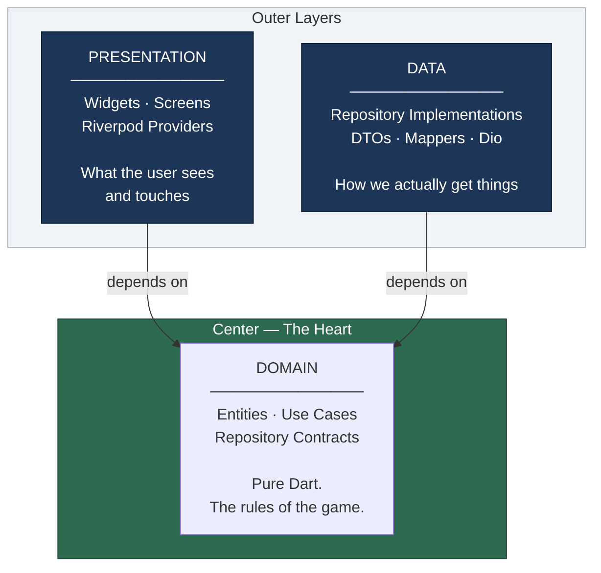
```mermaid
graph TD
    subgraph OUTER["Outer Layers"]
        P["PRESENTATION\n──────────────\nWidgets · Screens\nRiverpod Providers\n\nWhat the user sees\nand touches"]
        D["DATA\n──────────────\nRepository Implementations\nDTOs · Mappers · Dio\n\nHow we actually get things"]
    end

    subgraph CORE["Center — The Heart"]
        DM["DOMAIN\n──────────────\nEntities · Use Cases\nRepository Contracts\n\nPure Dart.\nThe rules of the game."]
    end

    P -->|"depends on"| DM
    D -->|"depends on"| DM

    style CORE fill:#2d6a4f,color:#fff,stroke:#1b4332
    style P fill:#1d3557,color:#fff,stroke:#0d2137
    style D fill:#1d3557,color:#fff,stroke:#0d2137
    style OUTER fill:#f0f4f8,stroke:#adb5bd
```

**Critical insight:**

- **Presentation** and **Data** are both "outer" layers
- **Domain** is the center — it depends on **nothing**
- Both outer layers point **inward** toward Domain
- Domain **never** points outward

---

## 3. The Dependency Rule

> **Source-code dependencies may only point INWARD.**

This is the single most important rule in Clean Architecture.

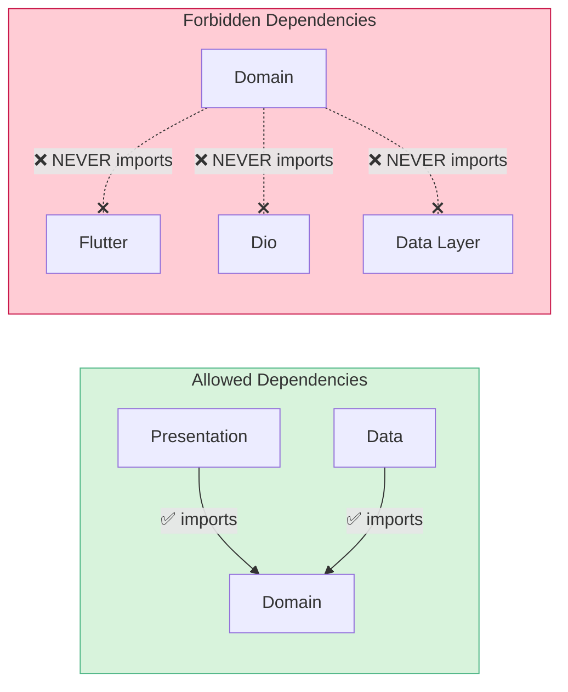
```mermaid
flowchart LR
    subgraph OK["Allowed Dependencies"]
        P1["Presentation"] -->|"✅ imports"| DO1["Domain"]
        DA1["Data"] -->|"✅ imports"| DO1
    end

    subgraph FORBIDDEN["Forbidden Dependencies"]
        DO2["Domain"] -.-x|"❌ NEVER imports"| F1["Flutter"]
        DO2 -.-x|"❌ NEVER imports"| F2["Dio"]
        DO2 -.-x|"❌ NEVER imports"| F3["Data Layer"]
    end

    style OK fill:#d8f3dc,stroke:#52b788
    style FORBIDDEN fill:#ffccd5,stroke:#c9184a
```

**Why this rule exists:**

The domain holds your **business rules**. Business rules must never depend on a framework (Flutter) or a library (Dio) — because those change, get replaced, or deprecated. The domain should survive any such replacement untouched.

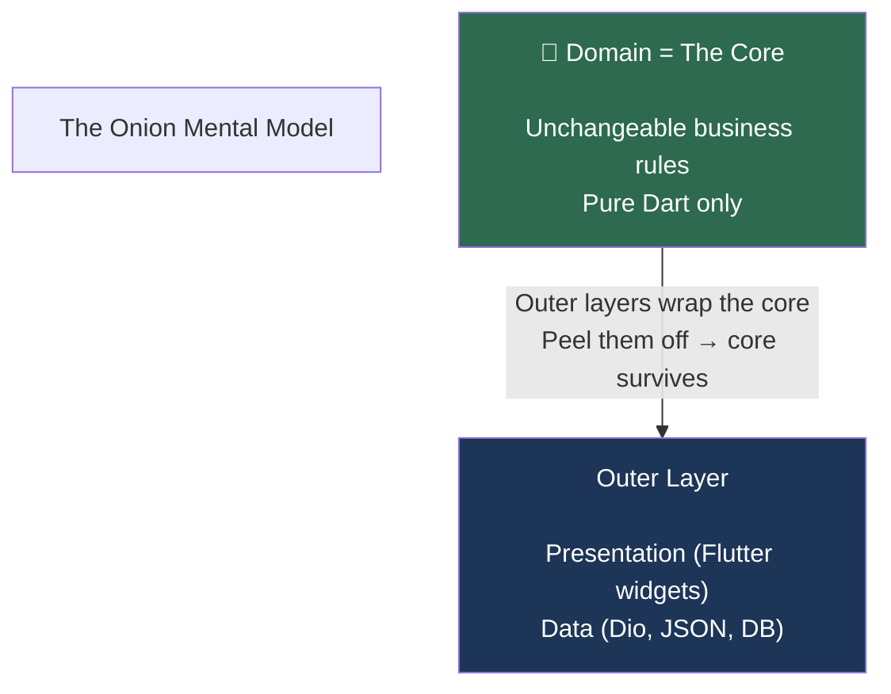
```mermaid
graph TD
    A["The Onion Mental Model"]
    B["🧅 Domain = The Core\n\nUnchangeable business rules\nPure Dart only"]
    C["Outer Layer\n\nPresentation (Flutter widgets)\nData (Dio, JSON, DB)"]

    B --> |"Outer layers wrap the core\nPeel them off → core survives"| C

    style B fill:#2d6a4f,color:#fff
    style C fill:#1d3557,color:#fff
```

---

## 4. The Domain Layer

The domain layer contains exactly **three things**:

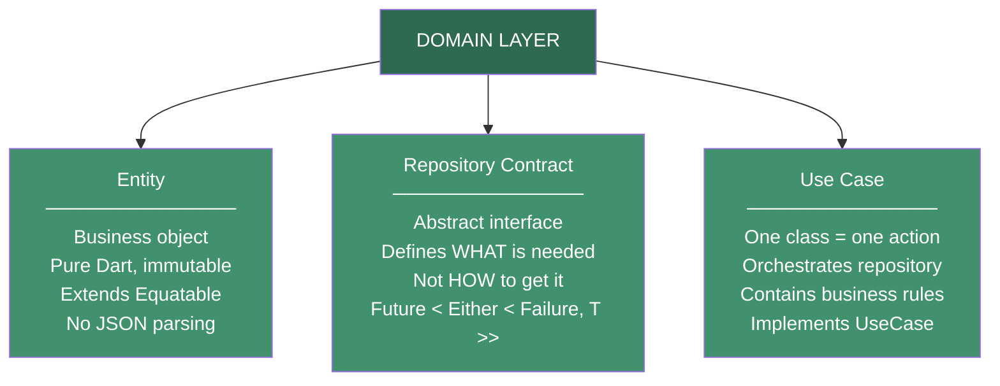
```mermaid
graph TD
    DOM["DOMAIN LAYER"]

    E["Entity\n──────────────\nBusiness object\nPure Dart, immutable\nExtends Equatable\nNo JSON parsing"]
    RC["Repository Contract\n──────────────\nAbstract interface\nDefines WHAT is needed\nNot HOW to get it\nFuture < Either < Failure, T >>"]
    UC["Use Case\n──────────────\nOne class = one action\nOrchestrates repository\nContains business rules\nImplements UseCase<T, P>"]

    DOM --> E
    DOM --> RC
    DOM --> UC

    style DOM fill:#2d6a4f,color:#fff
    style E fill:#40916c,color:#fff
    style RC fill:#40916c,color:#fff
    style UC fill:#40916c,color:#fff
```

### 4.1 Entity

A business object — not a JSON model. Represents the shape of a thing as the **business** cares about it.

```dart
class Task extends Equatable {
  final String id;      // String, not int — business decision
  final String title;
  final bool isDone;    // bool, not 0/1 — business shape

  const Task({required this.id, required this.title, required this.isDone});

  @override
  List<Object?> get props => [id, title, isDone];
}
```

**Entity rules:**
- `final` fields only (immutable)
- No Flutter imports
- No JSON parsing (`fromJson`/`toJson`)
- Extend `Equatable` for value equality

### 4.2 Repository Contract (Interface)

An **abstract promise**: *"someone, somewhere, will give me this data."*  
It declares **what** data is needed — never **how** to fetch it.

```dart
abstract interface class TaskRepository {
  Future<Either<Failure, List<Task>>> getTasks();
}
```

**Why the contract lives in Domain (not Data):**

Because it is a **business contract**, not an implementation detail. Moving it to the Data layer would force Domain to import Data — breaking the Dependency Rule.

### 4.3 Use Case

One class = one business action. It orchestrates the repository and contains any business rules.

```dart
class GetTasks implements UseCase<List<Task>, GetTasksParams> {
  const GetTasks(this._repository);
  final TaskRepository _repository;

  @override
  Future<Either<Failure, List<Task>>> call(GetTasksParams params) {
    return _repository.getTasks(cursor: params.cursor);
  }
}
```

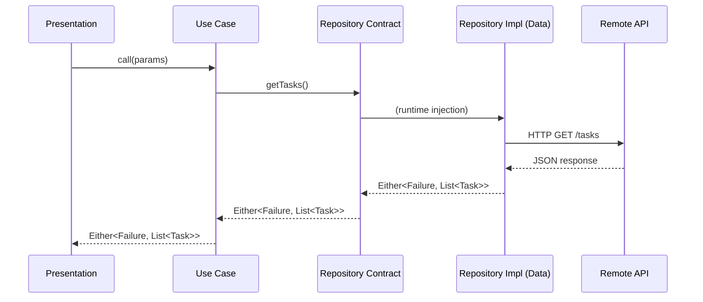
```mermaid
sequenceDiagram
    participant UI as Presentation
    participant UC as Use Case
    participant RC as Repository Contract
    participant RI as Repository Impl (Data)
    participant API as Remote API

    UI->>UC: call(params)
    UC->>RC: getTasks()
    RC->>RI: (runtime injection)
    RI->>API: HTTP GET /tasks
    API-->>RI: JSON response
    RI-->>RC: Either<Failure, List<Task>>
    RC-->>UC: Either<Failure, List<Task>>
    UC-->>UI: Either<Failure, List<Task>>
```

---

## 5. Dependency Inversion Principle (the "D" in SOLID)

**The puzzle:** If Domain can't import Data, how does a use case ever reach the real API?

**The answer:** The *contract (interface)* lives in Domain. The *implementation* lives in Data. At runtime, we inject the implementation.

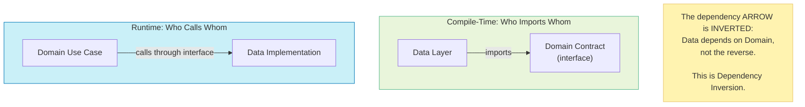
```mermaid
flowchart TB
    subgraph COMPILE["Compile-Time: Who Imports Whom"]
        direction LR
        DATA1["Data Layer"] -->|"imports"| DOM1["Domain Contract\n(interface)"]
    end

    subgraph RUNTIME["Runtime: Who Calls Whom"]
        direction LR
        DOM2["Domain Use Case"] -->|"calls through interface"| DATA2["Data Implementation"]
    end

    NOTE["The dependency ARROW is INVERTED:\nData depends on Domain,\nnot the reverse.\n\nThis is Dependency Inversion."]

    style COMPILE fill:#e9f5db,stroke:#52b788
    style RUNTIME fill:#caf0f8,stroke:#0077b6
    style NOTE fill:#fff3b0,stroke:#e9c46a
```

**In code:**

```
┌─────── Domain ──────────────────────────────────┐
│  abstract interface class TaskRepository { }    │  ← Contract lives here
└─────────────────────────────────────────────────┘
         ▲
         │ implements (Data imports Domain)
┌─────── Data ────────────────────────────────────┐
│  class TaskRepositoryImpl implements            │  ← Implementation here
│    TaskRepository { /* Dio calls here */ }      │
└─────────────────────────────────────────────────┘
```

---

## 6. DTO vs Entity — The Mapper Pattern

Every piece of data exists in **two shapes**:

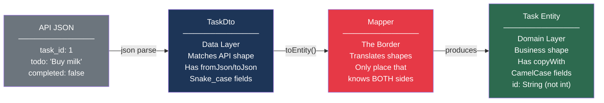
```mermaid
graph LR
    API["API JSON\n──────────────\ntask_id: 1\ntodo: 'Buy milk'\ncompleted: false"]

    DTO["TaskDto\n──────────────\nData Layer\nMatches API shape\nHas fromJson/toJson\nSnake_case fields"]

    MAP["Mapper\n──────────────\nThe Border\nTranslates shapes\nOnly place that\nknows BOTH sides"]

    ENT["Task Entity\n──────────────\nDomain Layer\nBusiness shape\nHas copyWith\nCamelCase fields\nid: String (not int)"]

    API -->|"json parse"| DTO
    DTO -->|"toEntity()"| MAP
    MAP -->|"produces"| ENT

    style API fill:#6c757d,color:#fff
    style DTO fill:#1d3557,color:#fff
    style MAP fill:#e63946,color:#fff
    style ENT fill:#2d6a4f,color:#fff
```

### Comparison Table

| | DTO | Entity |
|---|---|---|
| **Lives in** | Data layer | Domain layer |
| **Shape matches** | API JSON | Business logic |
| **Contains** | `fromJson`, `toJson` | `copyWith`, business methods |
| **Imports** | Can import anything | Pure Dart only |
| **Field naming** | `task_id` (snake_case from API) | `id` (camelCase, business name) |
| **Field types** | As API sends them (e.g., `int`) | As business needs (e.g., `String`) |

### Why Not Use DTOs Everywhere?

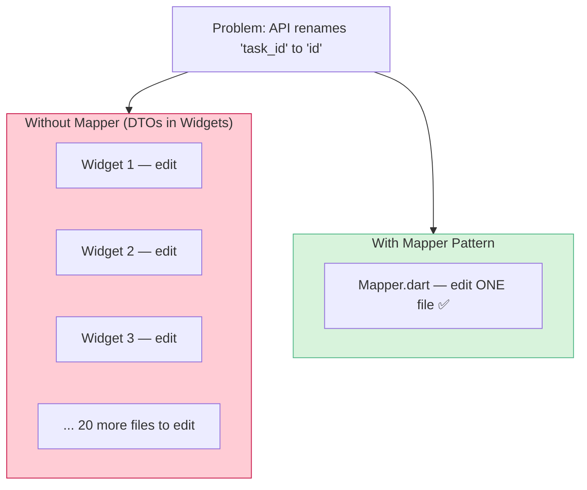
```mermaid
flowchart TD
    PROB["Problem: API renames 'task_id' to 'id'"]

    subgraph BAD["Without Mapper (DTOs in Widgets)"]
        B1["Widget 1 — edit"] 
        B2["Widget 2 — edit"]
        B3["Widget 3 — edit"]
        B4["... 20 more files to edit"]
    end

    subgraph GOOD["With Mapper Pattern"]
        G1["Mapper.dart — edit ONE file ✅"]
    end

    PROB --> BAD
    PROB --> GOOD

    style BAD fill:#ffccd5,stroke:#c9184a
    style GOOD fill:#d8f3dc,stroke:#52b788
```

---

## 7. The Two Magic Boundaries

Every request crosses **two walls** on its way from the API to the UI. Neither the DTO shape nor raw exceptions must ever escape the Data layer.

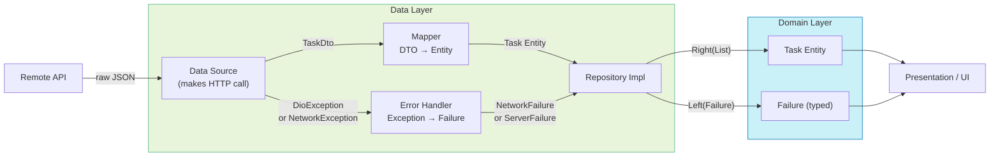
```mermaid
flowchart LR
    API["Remote API"]

    subgraph DATA["Data Layer"]
        DS["Data Source\n(makes HTTP call)"]
        MAP["Mapper\nDTO → Entity"]
        ERR["Error Handler\nException → Failure"]
        REPO["Repository Impl"]
    end

    subgraph DOM["Domain Layer"]
        ENT["Task Entity"]
        FAIL["Failure (typed)"]
    end

    UI["Presentation / UI"]

    API -->|"raw JSON"| DS
    DS -->|"TaskDto"| MAP
    MAP -->|"Task Entity"| REPO
    DS -->|"DioException\nor NetworkException"| ERR
    ERR -->|"NetworkFailure\nor ServerFailure"| REPO
    REPO -->|"Right(List<Task>)"| ENT
    REPO -->|"Left(Failure)"| FAIL
    ENT --> UI
    FAIL --> UI

    style DATA fill:#e9f5db,stroke:#52b788
    style DOM fill:#caf0f8,stroke:#0077b6
```

**The boundary code (in RepositoryImpl):**

```dart
try {
  final dtos = await _remote.getTasks();
  return Right(dtos.map((d) => d.toEntity()).toList()); // BOUNDARY 1: DTO → Entity
} on NetworkException {
  return const Left(NetworkFailure());                  // BOUNDARY 2: Exception → Failure
} on ServerException catch (e) {
  return Left(ServerFailure(e.message));
}
```

---

## 8. REST vs GraphQL

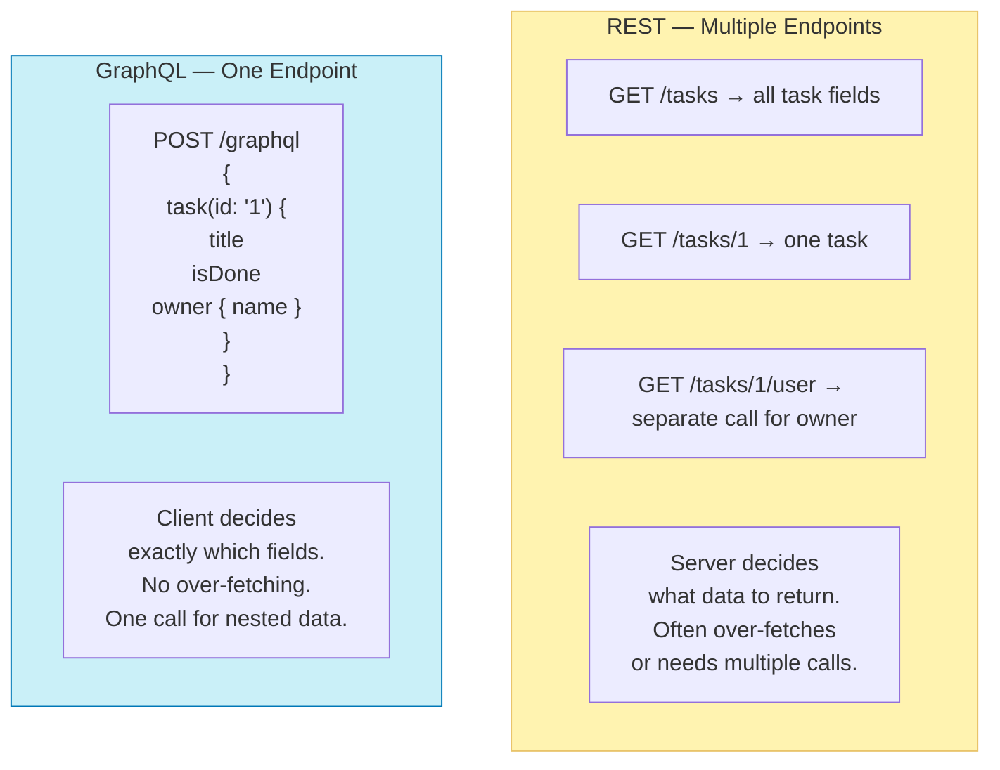
```mermaid
graph TB
    subgraph REST["REST — Multiple Endpoints"]
        R1["GET /tasks → all task fields"]
        R2["GET /tasks/1 → one task"]
        R3["GET /tasks/1/user → separate call for owner"]
        NOTE_R["Server decides\nwhat data to return.\nOften over-fetches\nor needs multiple calls."]
    end

    subgraph GQL["GraphQL — One Endpoint"]
        G1["POST /graphql\n{\n  task(id: '1') {\n    title\n    isDone\n    owner { name }\n  }\n}"]
        NOTE_G["Client decides\nexactly which fields.\nNo over-fetching.\nOne call for nested data."]
    end

    style REST fill:#fff3b0,stroke:#e9c46a
    style GQL fill:#caf0f8,stroke:#0077b6
```

### Comparison

| | REST | GraphQL |
|---|---|---|
| **Endpoints** | Many (one per resource) | One (`/graphql`) |
| **Response shape** | Server decides | Client decides |
| **Over-fetching** | Common | Eliminated |
| **Under-fetching** | Requires multiple calls | One query |
| **Learning curve** | Low | Higher |
| **Caching** | Easy (HTTP cache by URL) | Harder (POST body varies) |
| **Tooling** | Very mature | Mature but complex |
| **When to use** | Most apps | Complex UIs, many client types, bandwidth-sensitive |

---

## 9. When to Skip Use Cases

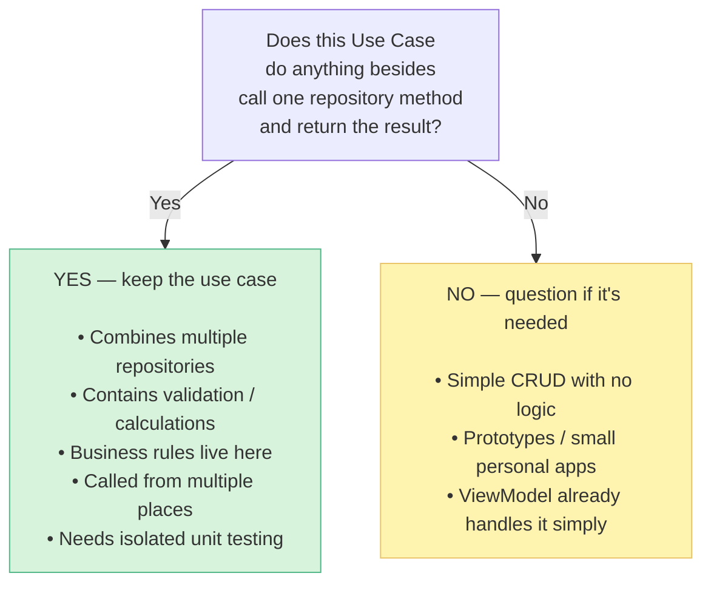
```mermaid
flowchart TD
    START["Does this Use Case\ndo anything besides\ncall one repository method\nand return the result?"]

    YES["YES — keep the use case\n\n• Combines multiple repositories\n• Contains validation / calculations\n• Business rules live here\n• Called from multiple places\n• Needs isolated unit testing"]

    NO["NO — question if it's needed\n\n• Simple CRUD with no logic\n• Prototypes / small personal apps\n• ViewModel already handles it simply"]

    START -->|"Yes"| YES
    START -->|"No"| NO

    style YES fill:#d8f3dc,stroke:#52b788
    style NO fill:#fff3b0,stroke:#e9c46a
```

**The rule of thumb:**  
> If your use case only calls one repository method and returns the result unchanged, question whether it adds value. If it does *anything* else — keep it.

In production apps (Careem, Talabat-scale), use cases almost always exist because real business logic is complex enough to justify them.

---

## 10. Day 1 Interview Key Phrases

| Question | Answer |
|---|---|
| What is the Dependency Rule? | Source dependencies point only inward toward the domain, so business logic never depends on frameworks — making it testable and change-resilient. |
| Where does the repository interface live? | In `domain/` — it's a business contract, not an implementation detail. Moving it to `data/` breaks the dependency rule. |
| What is Dependency Inversion? | Data depends on Domain (not the reverse) because Domain owns the interface. The arrow is inverted. |
| DTO vs Entity? | DTOs are the API's shape; Entities are the business's shape. The mapper translates between them at the border. |
| What are the two boundaries? | DTO→Entity and Exception→Failure. Neither leaks out of the data layer. |

---
---

# Day 2 — Networking & the API Client

---

## 1. The One Front Door Concept

Instead of creating a new `Dio()` instance per request (which loses all configuration), the entire app shares **one** configured `Dio` instance. Every request travels through the same chain of interceptors.

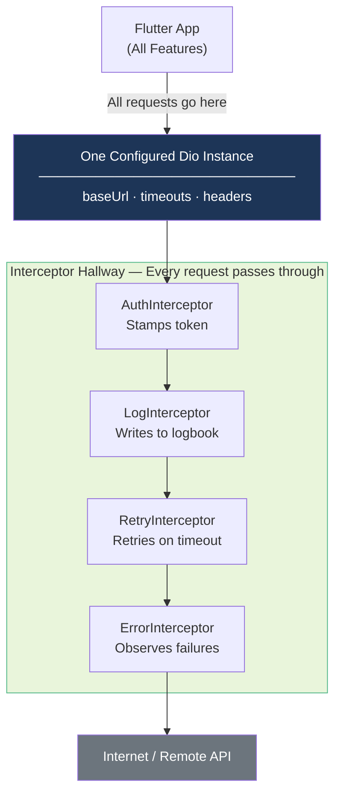
```mermaid
flowchart TD
    APP["Flutter App\n(All Features)"]

    DOOR["One Configured Dio Instance\n───────────────────────────\nbaseUrl · timeouts · headers"]

    subgraph HALLWAY["Interceptor Hallway — Every request passes through"]
        I1["AuthInterceptor\nStamps token"]
        I2["LogInterceptor\nWrites to logbook"]
        I3["RetryInterceptor\nRetries on timeout"]
        I4["ErrorInterceptor\nObserves failures"]
    end

    INTERNET["Internet / Remote API"]

    APP -->|"All requests go here"| DOOR
    DOOR --> I1
    I1 --> I2
    I2 --> I3
    I3 --> I4
    I4 --> INTERNET

    style DOOR fill:#1d3557,color:#fff
    style HALLWAY fill:#e9f5db,stroke:#52b788
    style INTERNET fill:#6c757d,color:#fff
```

**Why it matters:** Headers, auth, logging, timeouts, retries, and error translation are **cross-cutting concerns**. Handle them **once**, in one place. If the API adds a required header tomorrow, you edit **one file** — not 30.

---

## 2. HTTP Fundamentals

### Status Code Reference

| Code | Meaning | Who is to blame |
|---|---|---|
| 200 | OK | Nobody — success |
| 201 | Created | Nobody — success |
| 400 | Bad Request | You sent invalid data |
| 401 | Unauthorized | No token or expired token → refresh |
| 403 | Forbidden | Logged in, but not permitted |
| 404 | Not Found | Wrong URL or deleted resource |
| 422 | Unprocessable | Validation failed |
| 500 | Server Error | Backend crashed |

**Rule of thumb:** `2xx` = success · `4xx` = YOUR fault · `5xx` = SERVER's fault.

### HTTP Verbs

| Verb | Job | Idempotent? | Safe to retry? |
|---|---|---|---|
| GET | Read | Yes | Yes |
| POST | Create | No | **Never** (may duplicate) |
| PUT | Replace entirely | Yes | Yes |
| PATCH | Partial update | Usually | Usually |
| DELETE | Remove | Yes | Yes |

---

## 3. Interceptors — The Core Concept

An interceptor has **three hooks**. Understanding exactly **when** each fires is critical.

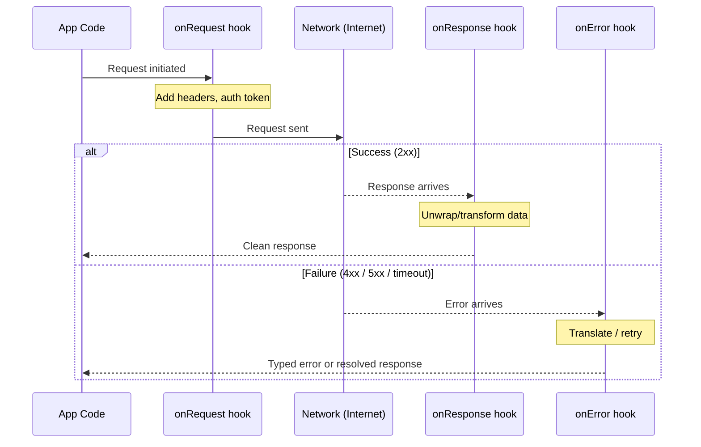
```mermaid
sequenceDiagram
    participant APP as App Code
    participant ONR as onRequest hook
    participant NET as Network (Internet)
    participant ONRes as onResponse hook
    participant ONErr as onError hook

    APP->>ONR: Request initiated
    Note over ONR: Add headers, auth token
    ONR->>NET: Request sent
    alt Success (2xx)
        NET-->>ONRes: Response arrives
        Note over ONRes: Unwrap/transform data
        ONRes-->>APP: Clean response
    else Failure (4xx / 5xx / timeout)
        NET-->>ONErr: Error arrives
        Note over ONErr: Translate / retry
        ONErr-->>APP: Typed error or resolved response
    end
```

> **Critical lesson learned the hard way:** A network error (401, timeout, connection reset) can **only** be caught in `onError` — **never** in `onRequest`. At `onRequest` time, the request hasn't even been sent yet. Putting error handling in `onRequest` is dead code.

### The Two Rules Every Interceptor MUST Follow

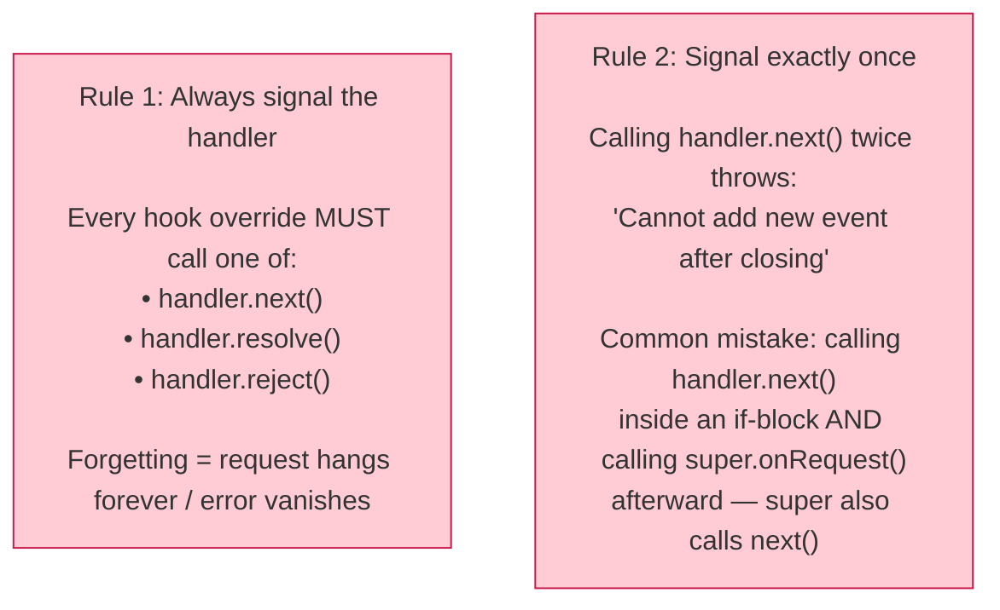
```mermaid
flowchart TD
    RULE1["Rule 1: Always signal the handler\n\nEvery hook override MUST call one of:\n• handler.next()\n• handler.resolve()\n• handler.reject()\n\nForgetting = request hangs forever / error vanishes"]

    RULE2["Rule 2: Signal exactly once\n\nCalling handler.next() twice throws:\n'Cannot add new event after closing'\n\nCommon mistake: calling handler.next()\ninside an if-block AND calling super.onRequest()\nafterward — super also calls next()"]

    style RULE1 fill:#ffccd5,stroke:#c9184a
    style RULE2 fill:#ffccd5,stroke:#c9184a
```

---

## 4. The Four Interceptors

### 4.1 AuthInterceptor — Stamps the Token (`onRequest`)

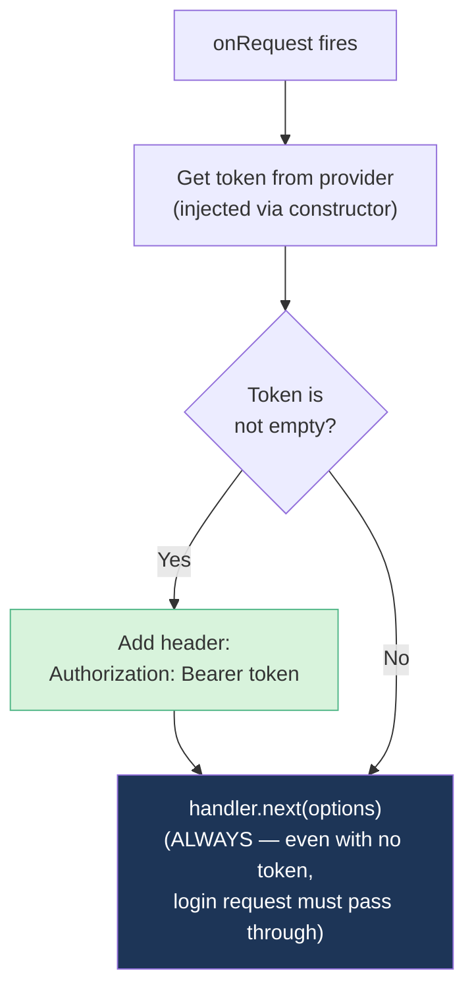
```mermaid
flowchart TD
    START["onRequest fires"]
    GET["Get token from provider\n(injected via constructor)"]
    CHECK{"Token is\nnot empty?"}
    ADD["Add header:\nAuthorization: Bearer token"]
    NEXT["handler.next(options)\n(ALWAYS — even with no token,\nlogin request must pass through)"]

    START --> GET
    GET --> CHECK
    CHECK -->|"Yes"| ADD
    ADD --> NEXT
    CHECK -->|"No"| NEXT

    style ADD fill:#d8f3dc,stroke:#52b788
    style NEXT fill:#1d3557,color:#fff
```

```dart
class AuthInterceptor extends Interceptor {
  AuthInterceptor(this._tokenProvider);
  final String Function() _tokenProvider; // injected — never hardcoded

  @override
  void onRequest(RequestOptions options, RequestInterceptorHandler handler) {
    final token = _tokenProvider();
    if (token.isNotEmpty) {
      options.headers['Authorization'] = 'Bearer $token';
    }
    handler.next(options); // ALWAYS signal — header is optional, signal is not
  }
}
```

**Key insight:** The `Authorization` header is added inside the `if` block, but `handler.next(options)` lives **outside** it. The "GO" signal is unconditional.

---

### 4.2 LogInterceptor — Built into Dio

```dart
LogInterceptor(requestBody: true, responseBody: true)
```

> **Security warning:** Never log tokens or response bodies in **production builds**. This is a security leak — strip the LogInterceptor in release mode.

---

### 4.3 RetryInterceptor — Retries Transient Timeouts (`onError`)

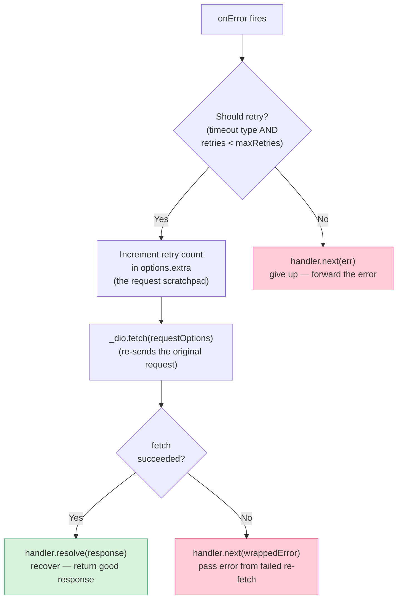
```mermaid
flowchart TD
    START["onError fires"]
    CHECK_RETRY{"Should retry?\n(timeout type AND\nretries < maxRetries)"}
    INCREMENT["Increment retry count\nin options.extra\n(the request scratchpad)"]
    FETCH["_dio.fetch(requestOptions)\n(re-sends the original request)"]
    SUCCESS{"fetch\nsucceeded?"}
    RESOLVE["handler.resolve(response)\nrecover — return good response"]
    GIVE_UP["handler.next(err)\ngive up — forward the error"]
    FORWARD_ERR["handler.next(wrappedError)\npass error from failed re-fetch"]

    START --> CHECK_RETRY
    CHECK_RETRY -->|"Yes"| INCREMENT
    INCREMENT --> FETCH
    FETCH --> SUCCESS
    SUCCESS -->|"Yes"| RESOLVE
    SUCCESS -->|"No"| FORWARD_ERR
    CHECK_RETRY -->|"No"| GIVE_UP

    style RESOLVE fill:#d8f3dc,stroke:#52b788
    style GIVE_UP fill:#ffccd5,stroke:#c9184a
    style FORWARD_ERR fill:#ffccd5,stroke:#c9184a
```

```dart
class RetryInterceptor extends Interceptor {
  RetryInterceptor(this._dio, {this.maxRetries = 2});
  final Dio _dio;
  final int maxRetries;

  @override
  void onError(DioException err, ErrorInterceptorHandler handler) async {
    final options = err.requestOptions;
    final retries = options.extra['retries'] ?? 0; // count in request's scratchpad

    if (_shouldRetry(err) && retries < maxRetries) {
      try {
        final response = await _dio.fetch(options..extra['retries'] = retries + 1);
        handler.resolve(response);
      } catch (e) {
        handler.next(e is DioException ? e : DioException(requestOptions: options, error: e));
      }
    } else {
      handler.next(err); // give up
    }
  }

  bool _shouldRetry(DioException err) =>
      err.type == DioExceptionType.connectionTimeout ||
      err.type == DioExceptionType.sendTimeout ||
      err.type == DioExceptionType.receiveTimeout;
}
```

**Three things learned the hard way:**

| Lesson | Why it matters |
|---|---|
| `_dio.fetch(requestOptions)` re-sends and returns a `Response` | You cannot fake a `Response` by casting an `Options` — they are different types |
| Store retry count in `options.extra` | The interceptor has no memory between calls; `extra` is a per-request scratchpad that travels with the request |
| Never retry blindly — only idempotent + transient failures | Retrying a POST may create a **duplicate** on the server if the request succeeded but the response timed out |

### What to NEVER retry

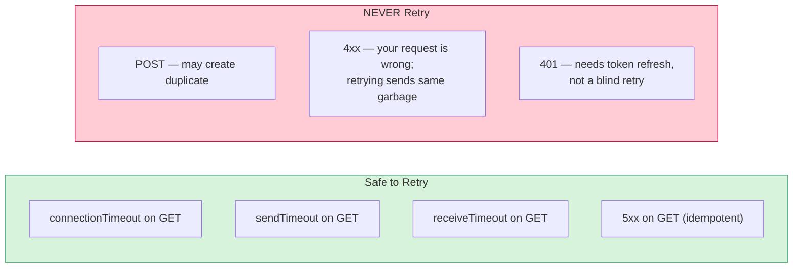
```mermaid
graph LR
    subgraph SAFE["Safe to Retry"]
        S1["connectionTimeout on GET"]
        S2["sendTimeout on GET"]
        S3["receiveTimeout on GET"]
        S4["5xx on GET (idempotent)"]
    end

    subgraph NEVER["NEVER Retry"]
        N1["POST — may create duplicate"]
        N2["4xx — your request is wrong;\nretrying sends same garbage"]
        N3["401 — needs token refresh,\nnot a blind retry"]
    end

    style SAFE fill:#d8f3dc,stroke:#52b788
    style NEVER fill:#ffccd5,stroke:#c9184a
```

---

### 4.4 ErrorInterceptor — Observes and Forwards (`onError`)

```dart
class ErrorInterceptor extends Interceptor {
  @override
  void onError(DioException err, ErrorInterceptorHandler handler) {
    final code = err.response?.statusCode;
    print('🔴 [ErrorInterceptor] type=${err.type} status=$code uri=${err.requestOptions.uri}');
    handler.next(err); // forward — data source does the real translation
  }
}
```

**Design decision:** Error *translation* into typed exceptions stays in the **data source** (single source of truth). The interceptor provides **one central place to observe every failure** — no duplicated translation logic.

---

## 5. Interceptor Order — Why It Matters

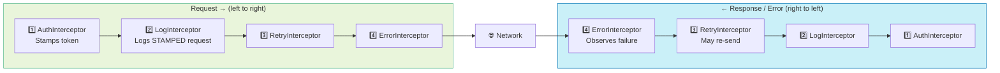
```mermaid
flowchart LR
    subgraph OUTGOING["Request → (left to right)"]
        A1["1️⃣ AuthInterceptor\nStamps token"] --> A2["2️⃣ LogInterceptor\nLogs STAMPED request"] --> A3["3️⃣ RetryInterceptor"] --> A4["4️⃣ ErrorInterceptor"]
    end

    NET["🌐 Network"]

    subgraph INCOMING["← Response / Error (right to left)"]
        B4["4️⃣ ErrorInterceptor\nObserves failure"] --> B3["3️⃣ RetryInterceptor\nMay re-send"] --> B2["2️⃣ LogInterceptor"] --> B1["1️⃣ AuthInterceptor"]
    end

    A4 --> NET
    NET --> B4

    style OUTGOING fill:#e9f5db,stroke:#52b788
    style INCOMING fill:#caf0f8,stroke:#0077b6
```

**Why Auth before Log?**

Log intercepts the request **after** Auth has stamped the token — so the log shows the *final* request **with** the `Authorization` header. If Log came first, you'd log an incomplete request without the token (misleading when debugging).

---

## 6. Handler Signals — The Golden Rule

Every interceptor hook receives a **handler**. You **must** call exactly **one** signal, exactly **once**.

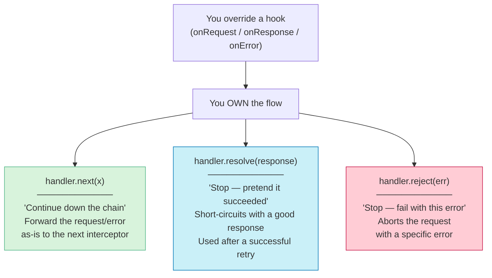
```mermaid
flowchart TD
    HOOK["You override a hook\n(onRequest / onResponse / onError)"]
    OWN["You OWN the flow"]

    NEXT["handler.next(x)\n────────────\n'Continue down the chain'\nForward the request/error\nas-is to the next interceptor"]

    RESOLVE["handler.resolve(response)\n────────────\n'Stop — pretend it succeeded'\nShort-circuits with a good response\nUsed after a successful retry"]

    REJECT["handler.reject(err)\n────────────\n'Stop — fail with this error'\nAborts the request\nwith a specific error"]

    HOOK --> OWN
    OWN --> NEXT
    OWN --> RESOLVE
    OWN --> REJECT

    style NEXT fill:#d8f3dc,stroke:#52b788
    style RESOLVE fill:#caf0f8,stroke:#0077b6
    style REJECT fill:#ffccd5,stroke:#c9184a
```

| Signal | When I used it |
|---|---|
| `handler.next(options)` | Auth: proceed after stamping the token |
| `handler.next(err)` | Error/Retry: forward error when giving up |
| `handler.resolve(response)` | Retry: after `_dio.fetch()` succeeds — recover |
| `handler.reject(err)` | (Available) Abort a request from inside an interceptor |

> **Golden rule:** Override a hook → you OWN the flow → you MUST signal the handler once.  
> Forget it → **request hangs forever**.  
> Do it twice → **crash** ("Cannot add new event after closing").

---

## 7. The 401 Auth Refresh Flow

When a request gets a 401, a smart client silently refreshes the token and retries — the user never notices.

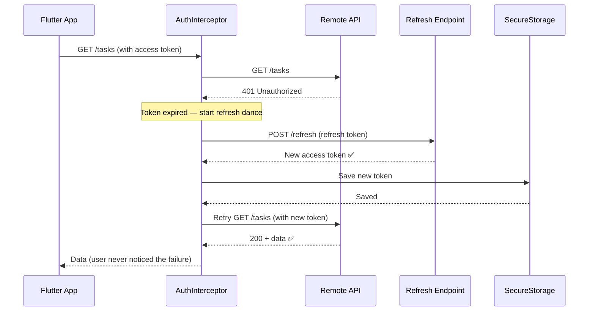
```mermaid
sequenceDiagram
    participant APP as Flutter App
    participant AUTH as AuthInterceptor
    participant API as Remote API
    participant REF as Refresh Endpoint
    participant SEC as SecureStorage

    APP->>AUTH: GET /tasks (with access token)
    AUTH->>API: GET /tasks
    API-->>AUTH: 401 Unauthorized

    Note over AUTH: Token expired — start refresh dance

    AUTH->>REF: POST /refresh (refresh token)
    REF-->>AUTH: New access token ✅

    AUTH->>SEC: Save new token
    SEC-->>AUTH: Saved

    AUTH->>API: Retry GET /tasks (with new token)
    API-->>AUTH: 200 + data ✅
    AUTH-->>APP: Data (user never noticed the failure)
```

### Token Refresh — Senior-Level Details

```mermaid
flowchart TD
    G1["Add infinite-loop guard flag\n\nIf the /refresh endpoint itself\nreturns 401, don't retry forever.\nSet a flag: 'isRefreshing = true'\nIf 401 arrives while flag is set → logout"]

    G2["Queue concurrent requests\nduring refresh\n\nIf 5 requests arrive while refreshing,\nhold them all in a queue.\nWhen refresh completes, retry all 5\nwith the new token simultaneously."]

    G3["Token storage: flutter_secure_storage\n\nKeychain (iOS) / Keystore /\nEncryptedSharedPreferences (Android)\n\nNEVER SharedPreferences — plain text,\nreadable on rooted/jailbroken devices"]

    style G1 fill:#fff3b0,stroke:#e9c46a
    style G2 fill:#caf0f8,stroke:#0077b6
    style G3 fill:#ffccd5,stroke:#c9184a
```

---

## 8. Error Translation at the Border

Raw library errors (`DioException`) must not leak into the domain or UI — they must be translated at the Data boundary.

```mermaid
flowchart LR
    DIO["DioException\n(library-specific,\ncannot control)"]

    YOUR["Your Exception\n(app-specific)\n\nNetworkException\nUnauthorizedException\nServerException"]

    FAIL["Failure\n(domain-level,\ntyped value)\n\nNetworkFailure\nServerFailure\nCacheFailure"]

    UI["UI Message\n(user-friendly)\n\n'No internet connection'\n'Please log in again'\n'Something went wrong'"]

    DIO -->|"Data Source\ntranslates"| YOUR
    YOUR -->|"Repository Impl\ntranslates"| FAIL
    FAIL -->|"UI reads\nand maps to string"| UI

    style DIO fill:#c9184a,color:#fff
    style YOUR fill:#e63946,color:#fff
    style FAIL fill:#457b9d,color:#fff
    style UI fill:#2d6a4f,color:#fff
```

**Translation code in the Data Source:**

```dart
on DioException catch (e) {
  if (e.response?.statusCode == 401) throw UnauthorizedException();
  if (e.response?.statusCode == 404) throw NotFoundException();
  if (e.type == DioExceptionType.connectionError) throw NetworkException();
  throw ServerException(e.message ?? 'Request failed');
}
```

> **Why the app showed a polite error instead of crashing:**  
> The error was caught and translated at every border — never left unhandled.  
> **A crash = an error nobody caught.**

---

## 9. Real-World Lessons

### Lesson A — API Shape Changed, Only Data Layer Cared

When the API was switched from `jsonplaceholder` (bare array, field `title`) to `dummyjson` (wrapped in `{ "todos": [...] }`, field `todo`):

```mermaid
flowchart TD
    CHANGE["API shape changed:\nfield name + wrapper object different"]

    subgraph TOUCHED["Files touched: 2"]
        T1["TaskDto.fromJson() — updated field name"]
        T2["Data Source — unwrap todos array"]
    end

    subgraph UNTOUCHED["Files NOT touched"]
        U1["Task Entity"]
        U2["TaskRepository contract"]
        U3["GetTasks Use Case"]
        U4["Riverpod Providers"]
        U5["All UI Widgets"]
    end

    CHANGE --> TOUCHED
    CHANGE --> UNTOUCHED

    style TOUCHED fill:#ffccd5,stroke:#c9184a
    style UNTOUCHED fill:#d8f3dc,stroke:#52b788
```

**Why?** The UI depends on the `Task` entity (a stable contract), not on API JSON. The mapper absorbs the difference.

### Lesson B — `int` vs `String` at the DTO Border

The API sends `"id": 1` (an `int`), but the entity wants `id` as a `String` (business decision).

```dart
// WRONG — crashes on type mismatch:
id: json['id'] as String,

// CORRECT — converts, doesn't cast:
id: (json['id'] as int).toString(),
```

`as` **casts** (and crashes on mismatch). `.toString()` **converts**.

### Lesson C — "Connection Reset by Peer" Was the Network, Not the Code

| Observation | What it meant |
|---|---|
| Request log showed correct URL, method, and all timeouts | Code was correct |
| `jsonplaceholder` consistently returned connection reset | Not a code bug |
| `curl` from dev machine reproduced the same error | DNS resolved fine |
| TLS handshake was reset | SNI-based filtering by network/ISP |
| Browser worked; direct clients (curl, Flutter) failed | ISP was blocking based on SNI hostname |
| Fix: switch to `dummyjson.com` (unblocked host) | Confirmed network issue |

> **Lesson:** When one app fails but the browser works on the same network, suspect **proxy/SNI filtering**, not your code.

---

## 10. Common Traps

```mermaid
graph TD
    T1["Creating a new Dio per request\n→ lose interceptors, config,\nand connection reuse"]
    T2["No timeouts set\n→ app hangs forever on bad network\nSet all 3: connect / send / receive"]
    T3["Logging tokens in production\n→ security leak\nStrip LogInterceptor in release builds"]
    T4["Infinite refresh loop\n→ 401 on refresh endpoint\nloops forever\nAdd a guard flag"]
    T5["Letting DioException reach the UI\n→ translate at the border, always"]
    T6["Retrying a POST\n→ duplicate creation\nif server got the request\nbut response timed out"]
    T7["Overriding a hook without\nsignalling the handler\n→ request hangs / error vanishes"]

    style T1 fill:#ffccd5,stroke:#c9184a
    style T2 fill:#ffccd5,stroke:#c9184a
    style T3 fill:#ffccd5,stroke:#c9184a
    style T4 fill:#ffccd5,stroke:#c9184a
    style T5 fill:#ffccd5,stroke:#c9184a
    style T6 fill:#ffccd5,stroke:#c9184a
    style T7 fill:#ffccd5,stroke:#c9184a
```

---

## 11. Dio Class Reference

### Classes Written

| Class | File | Extends | Job | Key method |
|---|---|---|---|---|
| `AuthInterceptor` | `core/network/interceptors/auth_interceptor.dart` | `Interceptor` | Adds `Authorization: Bearer <token>` to every outgoing request | `onRequest()` |
| `RetryInterceptor` | `core/network/interceptors/retry_interceptor.dart` | `Interceptor` | Re-sends the request (max 2×) on transient timeouts | `onError()` + `_shouldRetry()` |
| `ErrorInterceptor` | `core/network/interceptors/error_interceptor.dart` | `Interceptor` | Centrally observes/logs every failure, then forwards it | `onError()` |

### Dio Types Used (from the `dio` package)

| Type | What it is | Why it matters |
|---|---|---|
| `Dio` | The HTTP client — one shared, configured instance | The "front door." `dio.get/post/fetch(...)` sends requests. `dio.interceptors.add(...)` registers guards. |
| `BaseOptions` | Default config for every request | `baseUrl`, `connectTimeout`, `sendTimeout`, `receiveTimeout`, default headers |
| `Interceptor` | Base class for all interceptors | Override `onRequest` / `onResponse` / `onError`. You extend this. |
| `RequestOptions` | Description of a single outgoing request | Mutable: `headers`, `method`, `uri`, and **`extra`** (per-request scratchpad for retry count) |
| `Options` | A lighter request-config object | **NOT** a `Response` — do not confuse them; casting crashes |
| `Response<T>` | The server's reply | What `dio.fetch()` returns; what `handler.resolve(response)` needs. Read `response.data`, `response.statusCode` |
| `DioException` | Dio's error type | Read `err.type` and `err.response?.statusCode`. **Translate it — never let it reach the UI** |
| `DioExceptionType` | Enum of failure kinds | `connectionTimeout` / `sendTimeout` / `receiveTimeout` / `connectionError` / `badResponse` — used in `_shouldRetry` |
| `RequestInterceptorHandler` | Traffic controller for `onRequest` | `handler.next(options)` = proceed · `handler.reject(err)` = abort · `handler.resolve(response)` = fake success |
| `ErrorInterceptorHandler` | Traffic controller for `onError` | `handler.next(err)` = forward · `handler.resolve(response)` = recover · `handler.reject(err)` = stop |
| `LogInterceptor` | Built-in interceptor | Logs request/response — strip in production |

### Timeout Types Explained

```mermaid
flowchart LR
    APP["App"]
    
    CT["connectTimeout\n────────────\nTime to establish\nTCP/TLS connection\n\n'Can I reach the server?'"]
    
    ST["sendTimeout\n────────────\nTime to upload\nthe request body\n\n'Can I send my data?'"]
    
    RT["receiveTimeout\n────────────\nTime to download\nthe response\n\n'Can I get the answer?'"]
    
    SERVER["Server"]
    
    APP -->|"1"| CT
    CT -->|"2"| ST
    ST -->|"3"| RT
    RT -->|"4"| SERVER

    style CT fill:#457b9d,color:#fff
    style ST fill:#1d3557,color:#fff
    style RT fill:#0d2137,color:#fff
```

---

## 12. Day 2 Interview Vault

| Question | Answer |
|---|---|
| How does token refresh on 401 work? | Auth interceptor catches 401 → calls refresh endpoint → stores new token in secure storage → retries original request transparently. Add a **loop guard** flag and **queue concurrent requests** during refresh. |
| Where should tokens be stored? | `flutter_secure_storage` (Keychain on iOS, Keystore / EncryptedSharedPreferences on Android). **Never** `SharedPreferences` — it's plain text, readable on rooted/jailbroken devices. |
| Difference between connectTimeout, sendTimeout, receiveTimeout? | connect = establish TCP/TLS · send = upload request body · receive = download response body |
| Why use interceptors instead of per-call handling? | DRY principle + single source of truth for cross-cutting concerns. One edit → all requests updated. |
| When is it safe to retry a request? | Only idempotent + transient failures: timeouts and 5xx on GET/PUT/DELETE, capped retries with backoff. **Never retry POST** (may duplicate), **never retry 4xx** (request is fundamentally wrong). |
| How do you make networking testable? | Depend on the data-source interface, inject `Dio` via constructor, use `http_mock_adapter` in tests — no real network calls in test suites. |

---

## The One Sentence Summary

**Day 1:**
> *"Clean Architecture draws hard boundaries between Presentation, Domain, and Data — where the Domain is pure Dart at the center, dependencies only point inward, DTOs never escape the data layer, and exceptions become typed Failures before reaching the UI."*

**Day 2:**
> *"All traffic flows through one configured Dio client, where interceptors add the token, log the call, retry on transient failures, and translate every raw error into a typed one — so the rest of the app never touches networking details."*

---

*Days 3 & 4 documentation will be added once the corresponding notes are completed.*
