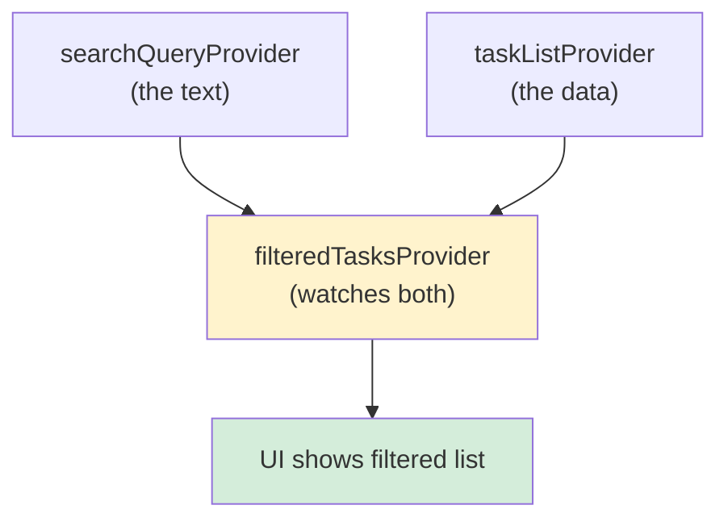
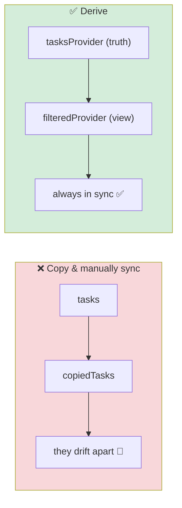
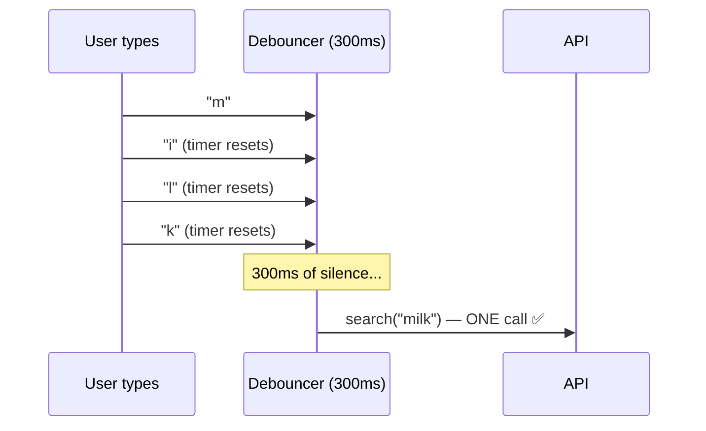
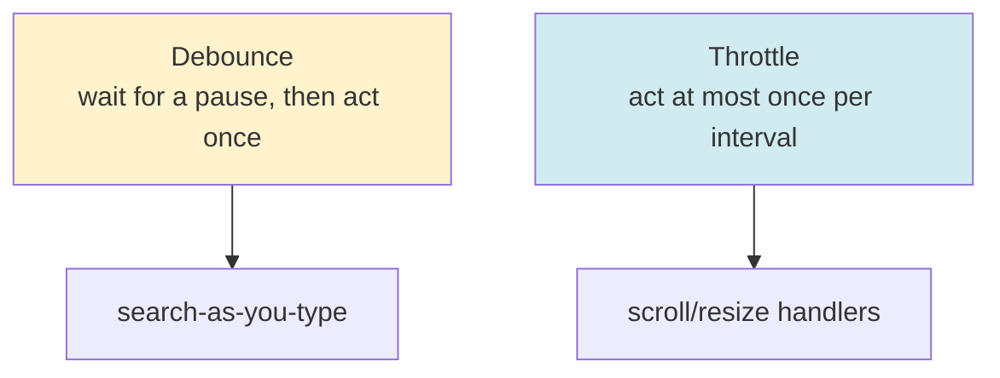
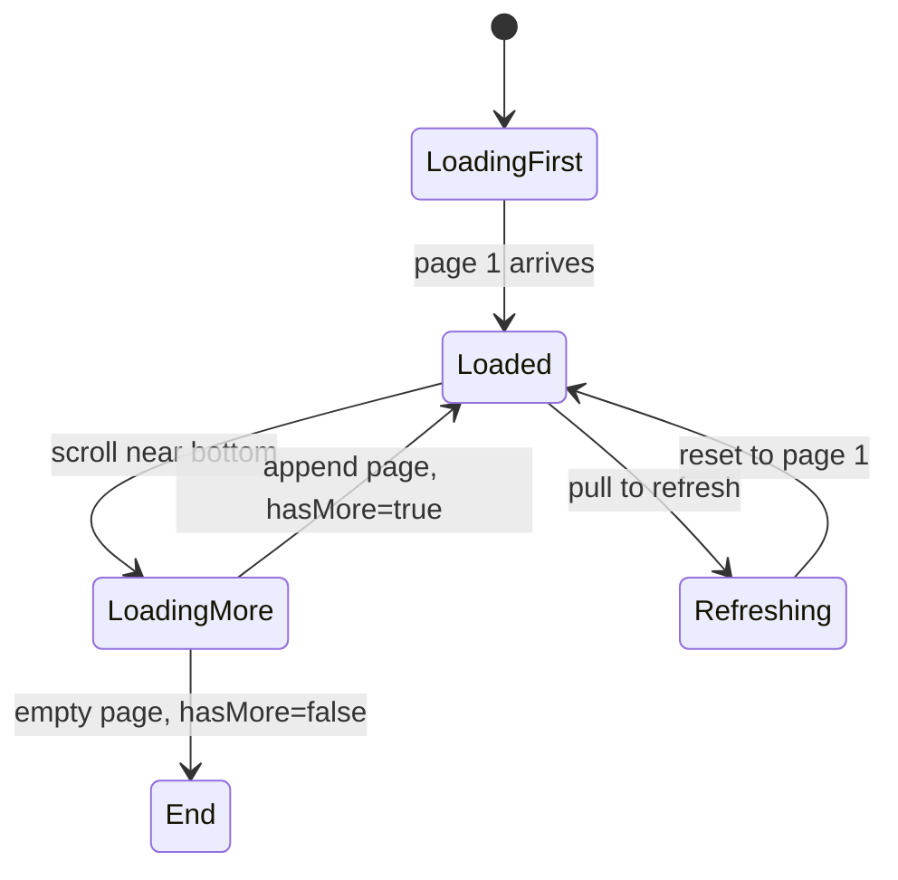
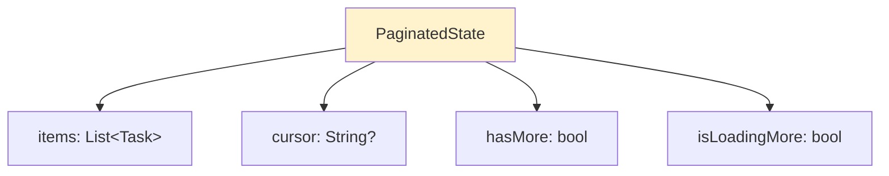
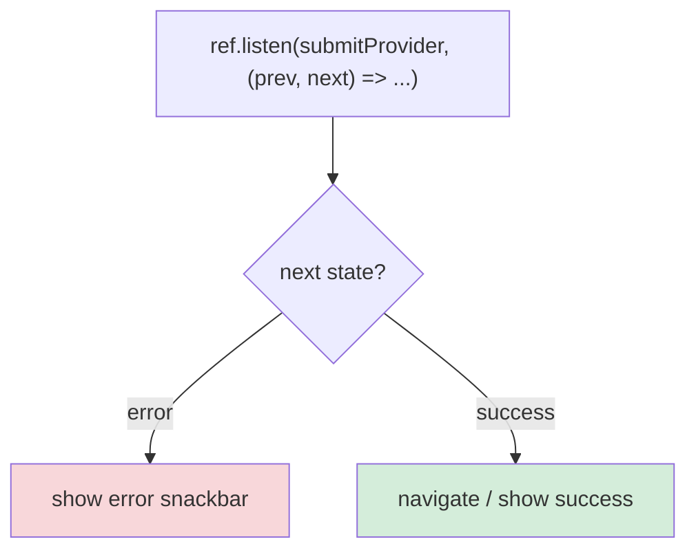
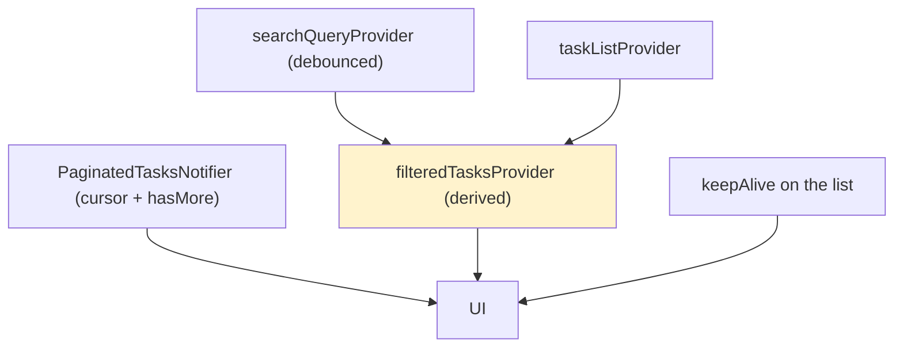

# 📖 Day 10 — Composition & Advanced Patterns ⭐
### *The chapter where providers start working together like an orchestra*

---

## 1. The Story 🎻

A single violin is nice. An orchestra is magic — instruments listening to each other, combining into something bigger. Today your providers stop being soloists and start **composing**.

**Rami** had a task list and a search box. To filter, he copied the list into the search widget, filtered it manually, and tried to keep both in sync with a flurry of `setState` calls. When the list updated, the search results didn't. When search changed, he re-filtered the wrong copy. Two sources of truth, endless bugs.

The Riverpod way: the search query is *one* provider, the task list is *another*, and a **derived provider** *watches both* and produces the filtered result automatically. Change either input, the output recomputes itself. No manual syncing, ever. Today you learn composition, debounced search, pagination state, and caching with `keepAlive`.

---

## 2. The Big Picture: Derived (Computed) Providers 🗺️

A provider can **watch other providers**. When any input changes, it recomputes — like a spreadsheet cell.



> **Mental model 📊:** Derived providers are **spreadsheet formulas**. Cell C1 = `A1 + B1`. Change A1 or B1, and C1 updates *itself* — you never manually recompute C1. `filteredTasks = filter(tasks, query)` works exactly like that.

---

## 3. The Critical Idea: One Source of Truth, Many Views 🎯

Don't *copy* data to transform it — *derive* a new view from it.



You can chain derivations: `tasks → filteredByQuery → sortedByDueDate → groupedByProject`. Each is a tiny, testable provider watching the previous.

---

## 4. Debounced Search ⏱️

If you fire an API call on *every keystroke*, typing "milk" = 4 requests. **Debouncing** waits until the user *stops* typing before acting.



Debounce vs throttle — know both:



> **Critical idea 💡:** Debounce saves the server *and* the user. Fewer requests, less jank, no flickering results. In Riverpod you implement it inside a notifier (cancel a pending timer on each change) or with `ref.onDispose` to clean up timers.

---

## 5. Pagination State 📜

Day 5 built the *data* side of pagination. Today is the *state* side — a notifier tracking pages.



The state the notifier holds:



> The `isLoadingMore` + `hasMore` flags prevent the classic bugs: firing 10 requests while one is in flight, and requesting forever past the end.

---

## 6. Caching with `keepAlive` & Side Effects 🔄

### `keepAlive` — survive navigation
By default `autoDispose` providers reset when you leave a screen. Sometimes you want the list to *persist* so returning is instant. `ref.keepAlive()` pins it.

```mermaid
flowchart LR
    A["autoDispose provider"] --> B{ref.keepAlive() called?}
    B -->|no| C["disposed on leave → refetch on return"]
    B -->|yes| D["state kept → instant on return ✅"]

    style D fill:#d4edda
```

### `ref.listen` — side effects done right
Navigation, snackbars, and dialogs are **side effects** — they don't belong in `build()`. Use `ref.listen` to react to state changes.



---

## 7. How This Maps to TaskFlow 🧩



Today: add a debounced `searchQueryProvider`, a derived `filteredTasksProvider`, a `PaginatedTasksNotifier`, use `keepAlive` so the list survives navigation, and use `ref.listen` to show a snackbar on a failed create.

---

## 8. Common Traps ⚠️

```mermaid
mindmap
  root((Day 10 Traps))
    Copying data to filter it
      Derive instead — one source of truth
    Searching on every keystroke
      Debounce it
    Pagination without hasMore/isLoadingMore
      Duplicate requests, infinite empties
    Navigation/snackbars inside build()
      Use ref.listen for side effects
    keepAlive everywhere
      Memory bloat — pin only what benefits
    Timers not disposed
      Leak — clean up in ref.onDispose
```

---

## 9. 🏢 Interview Vault — Questions From Top Middle East Companies
> *Composition + performance questions reveal senior Riverpod skill — heavily asked at Noon, Careem, Tabby.*

**Q1. What is a derived/computed provider and why prefer it over copying state?**
> **A:** A provider that watches other providers and recomputes when they change — like a spreadsheet formula. It keeps a single source of truth and guarantees the derived view (filtered/sorted list) is always in sync, eliminating the manual-sync bugs you get from copying data.
> *🎯 Really testing:* single-source-of-truth thinking.

**Q2. Debounce vs throttle — define and give a use for each.**
> **A:** Debounce waits for a pause in events then fires once (search-as-you-type). Throttle fires at most once per interval regardless of volume (scroll/resize). Debounce minimizes redundant work after bursts; throttle caps frequency.
> *🎯 Really testing:* you know both and pick correctly.

**Q3. How do you implement debounced search in Riverpod?**
> **A:** Keep the query in a provider; in a notifier, on each query change cancel any pending timer and start a new one (e.g. 300ms); when it fires, run the search. Clean up the timer in `ref.onDispose`. The result is a single API call after the user stops typing.
> *🎯 Really testing:* practical implementation + cleanup.

**Q4. What does `keepAlive` do and when should you use it?**
> **A:** It pins an `autoDispose` provider so its state survives when no widget watches it (e.g. navigating away), making return instant and avoiding refetch. Use it selectively for expensive/frequently-revisited state; overusing it wastes memory.
> *🎯 Really testing:* caching trade-offs.

**Q5. Why put navigation/snackbars in `ref.listen` and not `build`?**
> **A:** `build` can run many times and should be pure (just compute UI/state). Side effects there cause duplicate navigations or snackbars. `ref.listen` fires once per actual state change — the correct place for one-off effects.
> *🎯 Really testing:* understanding build purity vs side effects.

---

## 10. What You Must Be Able To Do By Tonight ✅
- [ ] Build a derived provider watching two others.
- [ ] Implement debounced search + explain vs throttle.
- [ ] Build a paginated notifier with hasMore/isLoadingMore.
- [ ] Use keepAlive + ref.listen correctly.
- [ ] Answer interview Q1–Q5 from memory.

## 11. The One Sentence To Remember 🧠
> **"Don't copy state — derive it: providers watch providers like spreadsheet formulas, debounce expensive inputs, track pagination with hasMore/isLoadingMore, and run side effects in `ref.listen`, not `build`."**

➡️ **Next chapter (Day 11):** we make it bulletproof — **testing** providers with overrides, and managing **form state** in Riverpod.
