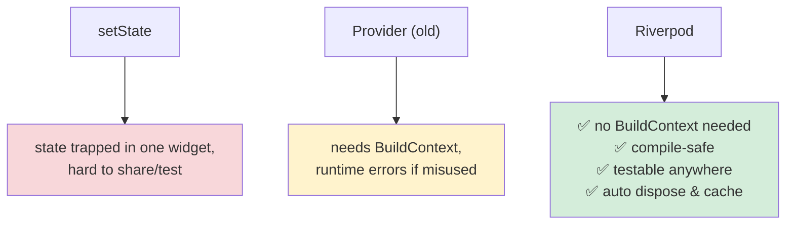
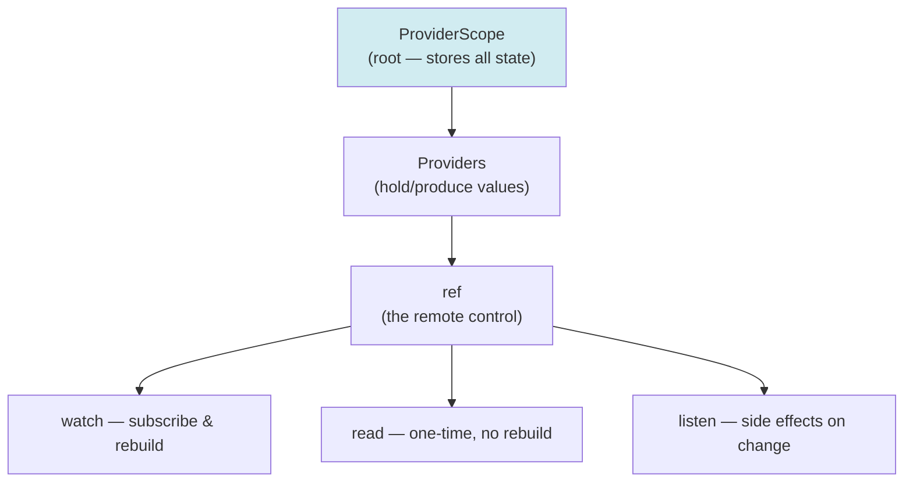
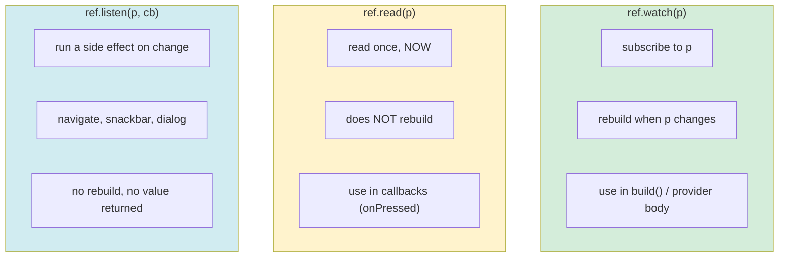
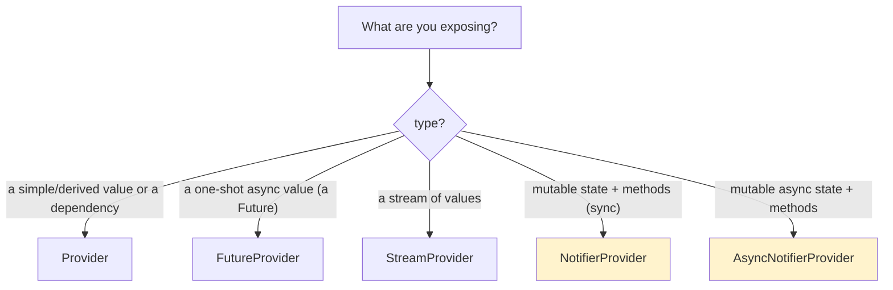
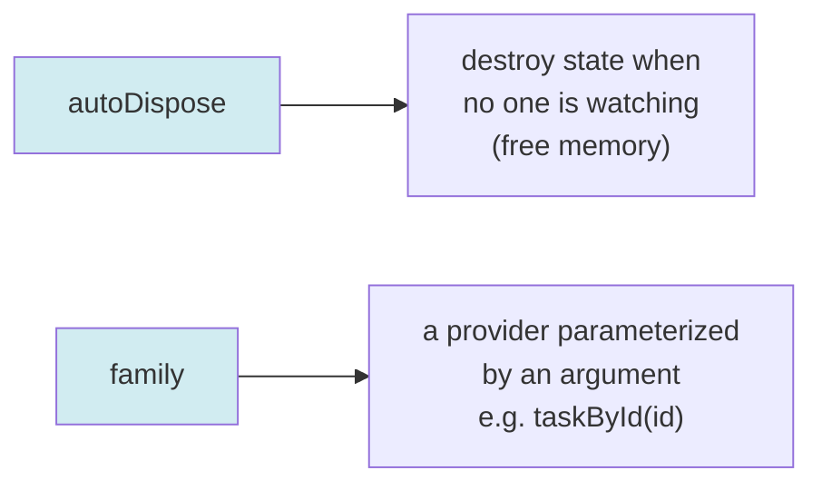
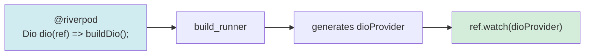
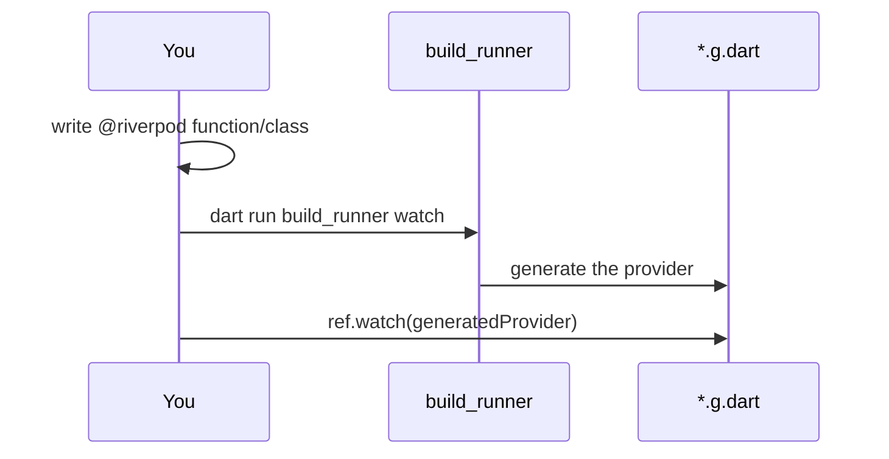
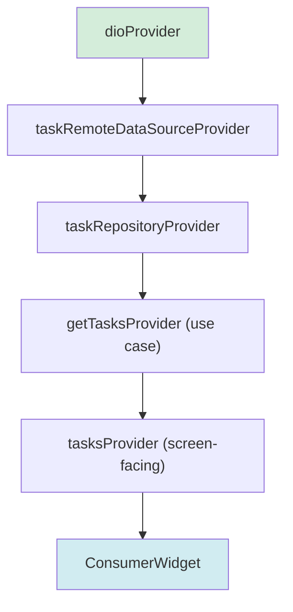
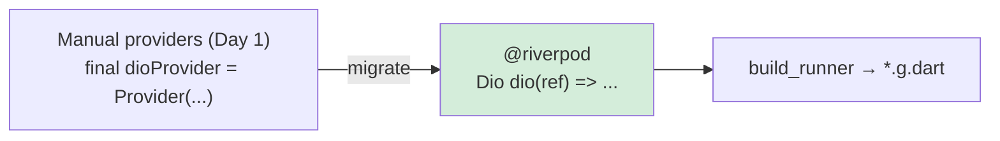
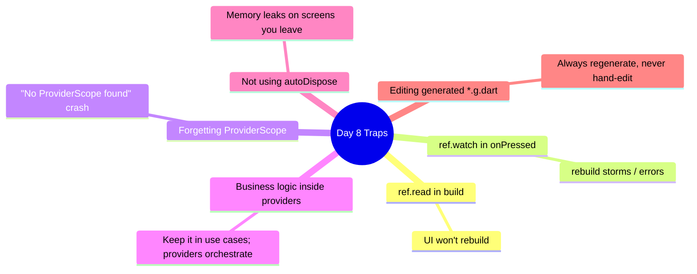

# 📖 Day 8 — Riverpod Foundations ⭐
### *The chapter where your app comes alive and learns to react*

---

## 1. The Story ⚡

Your TaskFlow has a beautiful skeleton: data layer, domain layer, use cases. But it's a **statue** — nothing moves. The user taps, and… nothing reacts. We need a nervous system: something that holds *state*, knows *who's watching it*, and tells the right widgets to *rebuild* when state changes. That nervous system is **state management**, and your tool is **Riverpod**.

**Fadi** tried to manage state with `setState` everywhere. Soon he had data duplicated across 5 widgets, a `StatefulWidget` calling APIs in `initState`, and no way to test any of it. He couldn't share the task list between two screens without passing it through 6 constructors ("prop drilling"). His app worked, but every new feature was agony.

Riverpod fixes this: state lives in **providers** — global, testable, type-safe containers — and any widget can *watch* exactly the state it needs, rebuilding automatically. Today you learn the foundations.

---

## 2. Why Riverpod? The Big Picture 🗺️

> **Mental model 🕸️:** Think of providers as a **web of light bulbs and switches**. A provider is a bulb holding a value. Widgets "watch" bulbs they care about. Flip a switch (change state) and *only the bulbs wired to it* light up (rebuild) — not the whole house. No wires threaded manually through every room (no prop drilling).

---

## 3. The Core Pieces 🧩

### `ProviderScope` — the root
Wraps your app. It's the *container* that stores every provider's state. No `ProviderScope`, no Riverpod.

### `ref` — your remote control
Every provider and `ConsumerWidget` gets a `ref`. It has three crucial methods you must never confuse:

> **The #1 beginner bug:** using `ref.read` in `build()` (UI won't update) or `ref.watch` in an `onPressed` callback (rebuild storms / errors). **Rule of thumb:** `watch` in build, `read` in callbacks, `listen` for side effects.

---

## 4. The Provider Family Tree 🌳

Riverpod has several provider types. Pick by *what kind of value* you're exposing:

| Provider | Holds | TaskFlow example |
|---|---|---|
| `Provider` | a value / dependency | the repository, a use case |
| `FutureProvider` | a `Future<T>` result | first fetch of tasks |
| `StreamProvider` | a `Stream<T>` | live task updates |
| `NotifierProvider` | mutable sync state + logic | a filter/toggle |
| `AsyncNotifierProvider` | mutable async state + logic | the task list (Day 9) |

### Two powerful modifiers

- **`autoDispose`**: when the last widget stops watching, the state is thrown away. Great for screens you leave.
- **`family`**: lets you pass an argument — `taskById('42')` creates a provider per id.

---

## 5. Code Generation: `@riverpod` ⚙️

Modern Riverpod uses code-gen — you write a function/class with `@riverpod`, and it generates the provider for you (less boilerplate, fewer mistakes).

---

## 6. Dependency Injection With Providers 💉

Here's where it clicks with the previous 7 days: **providers wire your whole clean architecture together.** Each provider depends on the one below it.

> **Critical idea 💡:** Riverpod *is* your dependency-injection system. You don't need `get_it` or manual singletons — `ref.watch(repositoryProvider)` gives you the wired-up repository, and in tests you *override* that provider with a fake. Architecture + DI + testability, one tool.

---

## 7. How This Maps to TaskFlow 🧩

Today you take the **manual** providers from Day 1's `task_providers.dart` and migrate them to **code-gen `@riverpod`**, add a `family` provider (`taskById`), and observe `autoDispose` in action.

---

## 8. Common Traps ⚠️

---

## 9. 🏢 Interview Vault — Questions From Top Middle East Companies
> *Riverpod is the most-asked state solution in 2026 Gulf/Egypt job posts. Careem, Tabby, Noon, Foodics expect fluency.*

**Q1. Why Riverpod over Provider or setState?**
> **A:** Riverpod is compile-safe (errors caught at compile time, not runtime), doesn't need `BuildContext`, is testable outside the widget tree, supports auto-dispose and caching, and avoids prop drilling. Provider depends on `BuildContext` and can throw at runtime; setState traps state in one widget.
> *🎯 Really testing:* you can articulate concrete advantages, not just "it's newer."

**Q2. Difference between `ref.watch`, `ref.read`, and `ref.listen`?**
> **A:** `watch` subscribes and rebuilds on change — use in `build`/provider bodies. `read` reads once without subscribing — use in callbacks like `onPressed`. `listen` runs a side effect (navigation, snackbar) on change without rebuilding. Misusing them (read in build, watch in callbacks) is the classic bug.
> *🎯 Really testing:* the single most common Riverpod mistake.

**Q3. What do `autoDispose` and `family` do?**
> **A:** `autoDispose` destroys a provider's state when nothing watches it (frees memory, resets screen state). `family` parameterizes a provider by an argument, e.g. `taskById(id)` builds one instance per id. They combine: `taskById(id)` with autoDispose cleans up per-id state.
> *🎯 Really testing:* lifecycle + parameterization understanding.

**Q4. How does Riverpod help dependency injection and testing?**
> **A:** Providers declare dependencies (`ref.watch(repoProvider)`), so the graph is wired automatically — no service locator needed. In tests, `ProviderScope(overrides: [...])` swaps real providers for fakes, letting you test any layer in isolation.
> *🎯 Really testing:* connecting Riverpod to architecture + testability.

**Q5. When would you choose `Provider` vs `FutureProvider` vs `NotifierProvider`?**
> **A:** `Provider` for a synchronous value or a dependency (a repository). `FutureProvider` for a one-shot async read. `NotifierProvider`/`AsyncNotifierProvider` when state is mutable and needs methods (load, add, toggle). Pick by whether state changes and whether it's async.
> *🎯 Really testing:* choosing the right tool — a real day-to-day skill.

---

## 10. What You Must Be Able To Do By Tonight ✅
- [ ] Explain watch vs read vs listen and when each is wrong.
- [ ] Name each provider type + when to use it.
- [ ] Explain autoDispose + family with examples.
- [ ] Migrate TaskFlow providers to `@riverpod` and add `taskById`.
- [ ] Answer interview Q1–Q5 from memory.

## 11. The One Sentence To Remember 🧠
> **"State lives in providers; widgets `watch` exactly what they need and rebuild automatically — and the provider graph doubles as your dependency injection and test-override system."**

➡️ **Next chapter (Day 9):** we handle *async* state properly — loading, error, and data — with `AsyncNotifier` and optimistic updates.
