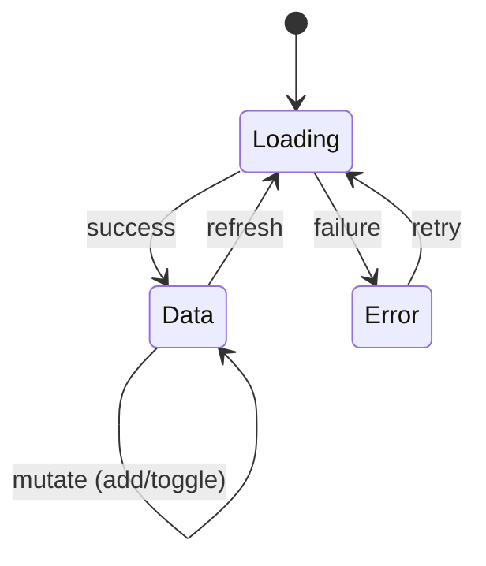
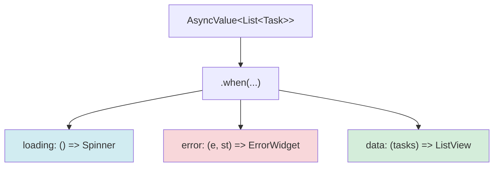
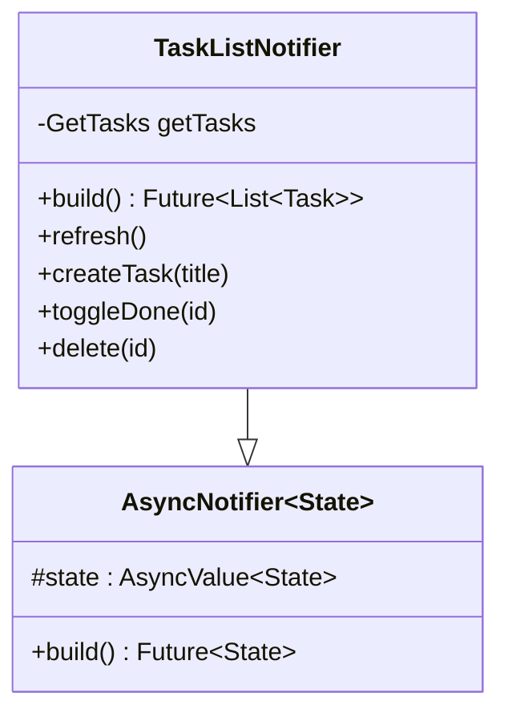
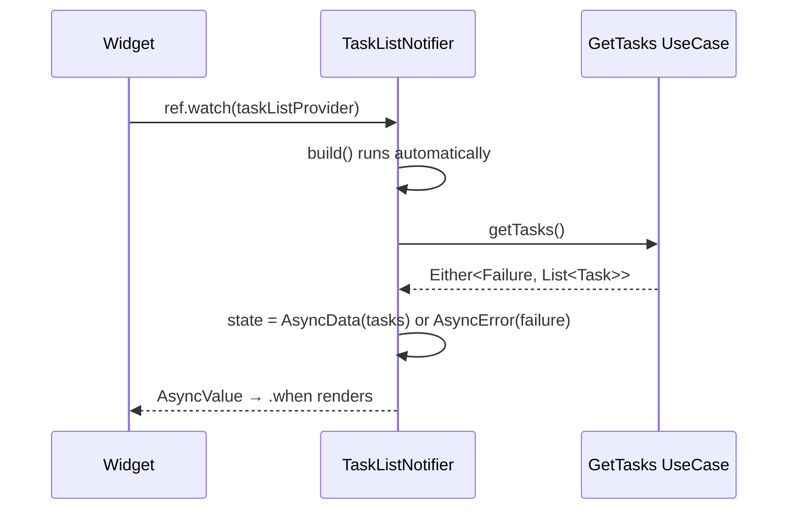
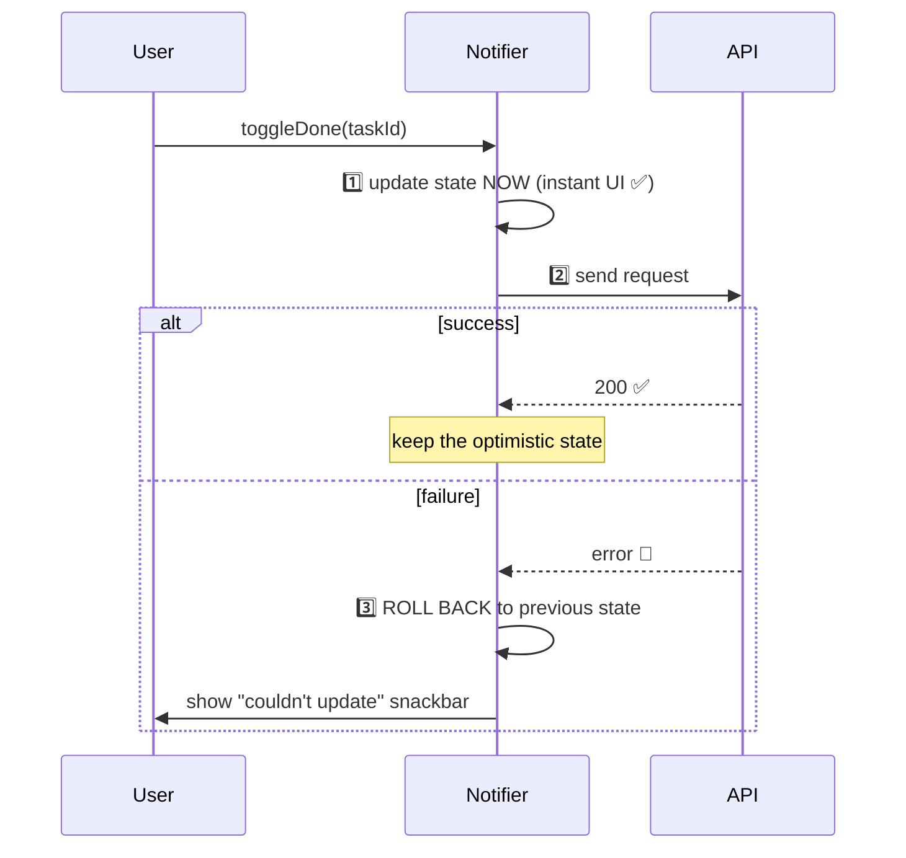
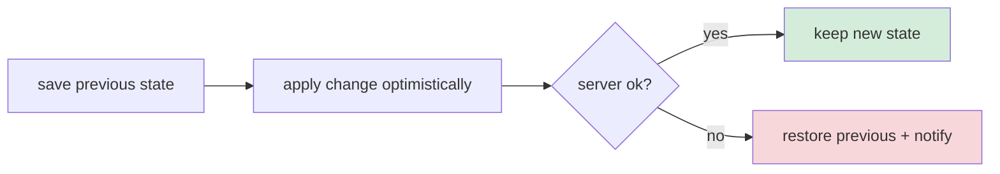
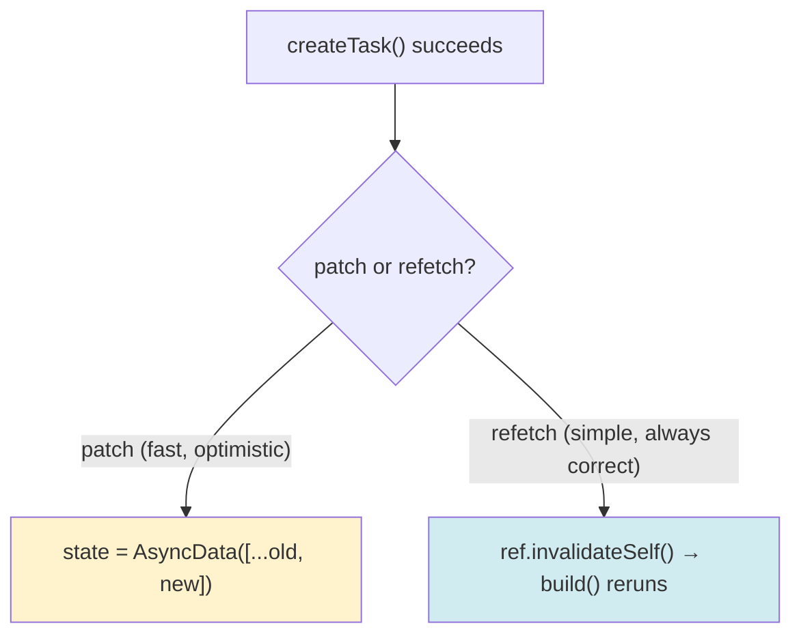
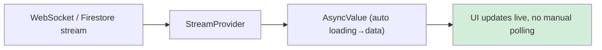
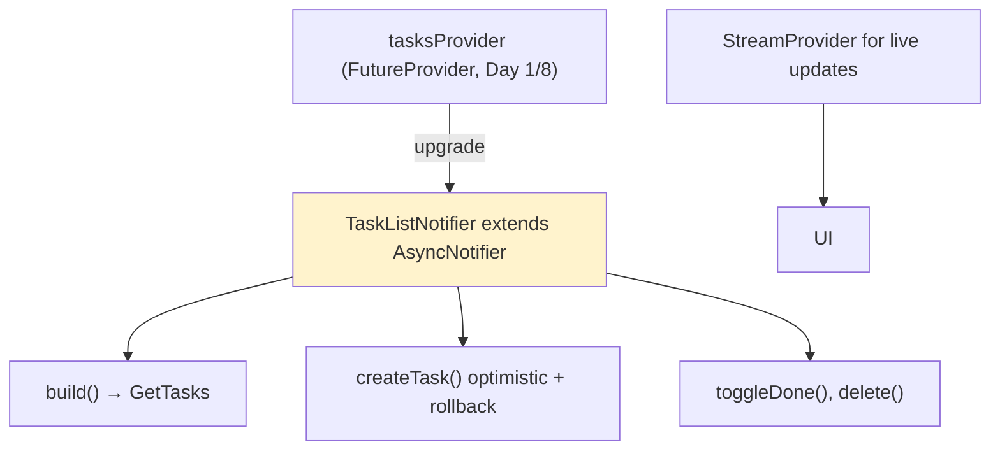
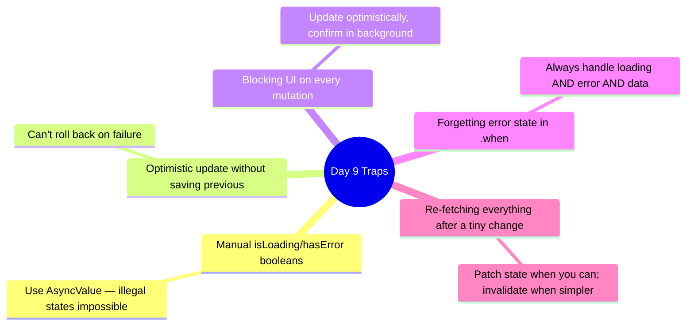

# 📖 Day 9 — Async State with AsyncNotifier ⭐
### *The chapter where loading spinners, errors, and data stop being a mess*

---

## 1. The Story ⏳

Every real screen has the same three faces: **loading** (fetching), **error** (it failed), and **data** (here it is). 

**Nour** managed these with three separate booleans: `isLoading`, `hasError`, `errorMessage`, plus the `tasks` list. Four variables, manually juggled. She forgot to set `isLoading = false` on error once — infinite spinner. She showed stale data while also showing an error. The states *contradicted* each other because nothing forced them to be mutually exclusive.

Riverpod's answer is **`AsyncValue<T>`** — a single type that is *always exactly one* of loading, error, or data. You can't be in two states at once. And **`AsyncNotifier`** is the class that produces and mutates that state cleanly. Today, async state becomes effortless.

---

## 2. The Big Picture: `AsyncValue` 🗺️

`AsyncValue<List<Task>>` is **always** in one of three states — never two. You render it with `.when`:

> **Mental model 🚦:** `AsyncValue` is a **traffic light**. It is red OR yellow OR green — never two colors at once. Your old four-boolean approach was like four separate lights that could all be on, contradicting each other. One enum-like type makes illegal states *impossible*.

---

## 3. `AsyncNotifier` — The State Producer 🏭

A `Notifier` holds mutable state and exposes methods to change it. The **async** version, `AsyncNotifier`, holds an `AsyncValue` and is perfect for data that loads from a repository.

The lifecycle:

- **`build()`** runs once to produce the initial state (Riverpod auto-wraps it in loading→data/error).
- **Methods** (`refresh`, `createTask`, …) mutate `state` afterward.

---

## 4. The Critical Idea: Optimistic Updates 🎯

When the user toggles a task done, do you make them *wait* for the server? No. You update the UI **instantly** (optimistically), then quietly confirm with the server — and **roll back** if it fails.

> **Critical idea 💡:** Optimistic updates trade a tiny risk (rare rollback) for a huge UX win (instant feedback). The app feels *fast* because it doesn't wait for round-trips. The key is **keeping the previous state** so you can undo.

---

## 5. Mutations & Invalidation ♻️

After a mutation, you sometimes want to **refetch** rather than hand-patch state. Riverpod gives you `ref.invalidateSelf()` (re-run `build()`) and `ref.invalidate(otherProvider)`.

---

## 6. Live Data with `StreamProvider` 📡

For real-time task status (a teammate completes a task), you watch a **stream**. `StreamProvider` turns a `Stream<T>` into an `AsyncValue<T>` automatically.

---

## 7. How This Maps to TaskFlow 🧩

Today: replace the `FutureProvider` with a `TaskListNotifier`, implement optimistic create with rollback, add toggle/delete, and wire a `StreamProvider` for live updates (a mock stream is fine).

---

## 8. Common Traps ⚠️

---

## 9. 🏢 Interview Vault — Questions From Top Middle East Companies
> *Async state is where Careem, Talabat, Noon separate "can use Riverpod" from "understands Riverpod."*

**Q1. What is `AsyncValue` and why is it better than separate loading/error/data flags?**
> **A:** `AsyncValue<T>` is a union that is always exactly one of loading, error, or data — making contradictory states (loading *and* error) impossible. Separate booleans must be manually kept consistent and are error-prone. `.when` forces you to handle all three cases.
> *🎯 Really testing:* the "make illegal states unrepresentable" principle.

**Q2. Explain optimistic updates and how you roll back.**
> **A:** Update local state immediately for instant feedback, save the previous state, send the request, and if it fails, restore the previous state and notify the user. It trades a rare rollback for a much faster-feeling UI.
> *🎯 Really testing:* the rollback detail — many candidates forget to save previous state.

**Q3. `AsyncNotifier` vs `FutureProvider` — when each?**
> **A:** `FutureProvider` is for a read-only one-shot async value. `AsyncNotifier` is for async state you also *mutate* (add, toggle, delete) via methods, while still exposing loading/error/data. Use AsyncNotifier whenever the data changes after load.
> *🎯 Really testing:* mutable vs read-only async.

**Q4. After creating an item, do you patch state or invalidate/refetch?**
> **A:** Both are valid. Patching (`state = AsyncData([...old, new])`) is fast and enables optimism but risks drift from the server. Invalidating (`ref.invalidateSelf()`) refetches and is always correct but slower and shows a reload. Choose by UX needs; often patch optimistically, then reconcile.
> *🎯 Really testing:* trade-off awareness.

**Q5. How do you handle real-time updates?**
> **A:** Expose the data source's `Stream` via a `StreamProvider` (or have the notifier listen to it), which auto-maps to `AsyncValue`. The UI updates live without polling. Handle reconnection in the data source.
> *🎯 Really testing:* streams + AsyncValue integration.

---

## 10. What You Must Be Able To Do By Tonight ✅
- [ ] Explain `AsyncValue` and the traffic-light analogy.
- [ ] Implement an `AsyncNotifier` with build() + mutations.
- [ ] Implement optimistic create/toggle with rollback.
- [ ] Wire a `StreamProvider` for live updates.
- [ ] Answer interview Q1–Q5 from memory.

## 11. The One Sentence To Remember 🧠
> **"`AsyncValue` makes loading/error/data mutually exclusive, `AsyncNotifier` produces and mutates it, and optimistic updates (with a saved previous state for rollback) make the app feel instant."**

➡️ **Next chapter (Day 10):** we compose providers — derived state, debounced search, pagination, and caching with `keepAlive`.
